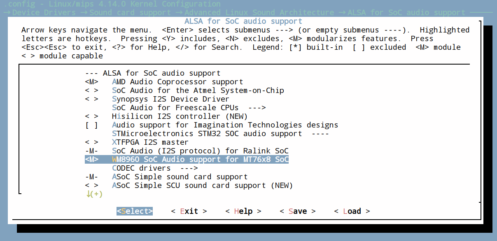

MT76x8 WM8960 ALSA SoC machine driver
=====================================

ALSA SoC machine driver for MT7628/88 SoC with WM8960 CODEC chip.

## Requirements

* Linux kernel 4.9 or later.

## Preparing for build

* Add `linux/sound/soc/ralink` folder to your kernel.
* Add `source "sound/soc/ralink/Kconfig"` line to your `sound/soc/Kconfig`.(no need if the line exists)
* Modify your DTS file according to `example.dts`.

## Configuring the kernel

`make menuconfig` (Use `make kernel_menuconfig` in OpenWrt SDK)

* Navigate to `> Device Drivers > Sound card support > Advanced Linux Sound Architecture > ALSA for SoC audio support`.
* Use Space key to enable `WM8960 SoC Audio support for MT76x8 SoC` module.



## Known issues

1. Capture does not work.
2. Need to turn on `"Left Output Mixer PCM"` and `"Right Output Mixer PCM"` via `alsamixer` or `amixer` before playback.

## About WM8960 MCLK

WM8960 could get MCLK from either an externel clock source or MT7628/88's REFCLK pin.

Modify your dts file as following can enable MT7628/88's REFCLK pin:

```
refclk {
    ralink,group = "refclk";
    ralink,function = "refclk";
};
```

## WM8960 block diagram


