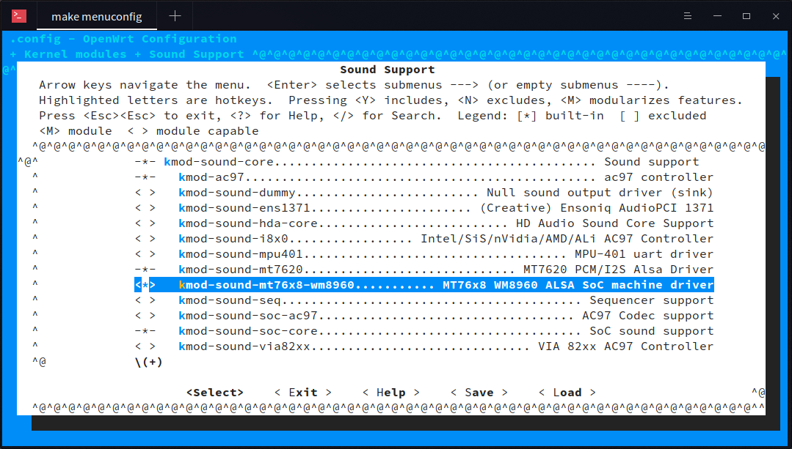

MT76x8 WM8960 ALSA SoC machine driver
=====================================

ALSA SoC machine driver for MT7628/88 SoC with WM8960 CODEC chip.

## Requirements

* OpenWrt with kernel 4.9 or later.

## Preparing

* Add the `mt76x8-wm8960` folder to OpenWrt's `package/kernel` folder.
* Modify the target DTS file according to `example.dts`.

## Configure the OpenWrt

`make menuconfig`

* Navigate to `> Kernel modules > Sound Support`.
* Enable `kmod-sound-core` and `kmod-sound-mt76x8-wm8960`.



## Settings

### Playback:

```
amixer sset "Left Output Mixer PCM" on
amixer sset "Right Output Mixer PCM" on
amixer sset "Headphone" 90%
amixer sset "Speaker" 90%
```

### Capture:

```
amixer sset "Left Input Mixer Boost" on
amixer sset "Right Input Mixer Boost" on
amixer sset "ALC Function" "Stereo"
```

## WM8960 MCLK

WM8960 can get `MCLK` from an externel clock source or MT7628/88's `refclk` (~12MHz).

To enable MT7628/88's `refclk` output, you can modify the dts file as follows:
```
refclk {
	ralink,group = "refclk";
	ralink,function = "refclk";
};
```

## WM8960 ADCLRC

WM8960 can internally get `ADCLRC` from `DACLRC` and the `ADCLRC` pin can be used as `GPIO1`.

To enable this feature, add the patch file from `patches-4.14` to OpenWrt's `target/linux/ramips/patches-4.14` folder and modify the dts file as follows:
```
codec: wm8960@1a {
	compatible = "wlf,wm8960";
	reg = <0x1a>;
	wlf,shared-lrclk;
	wlf,adclrc-gpio;
};
```

## WM8960 block diagram


