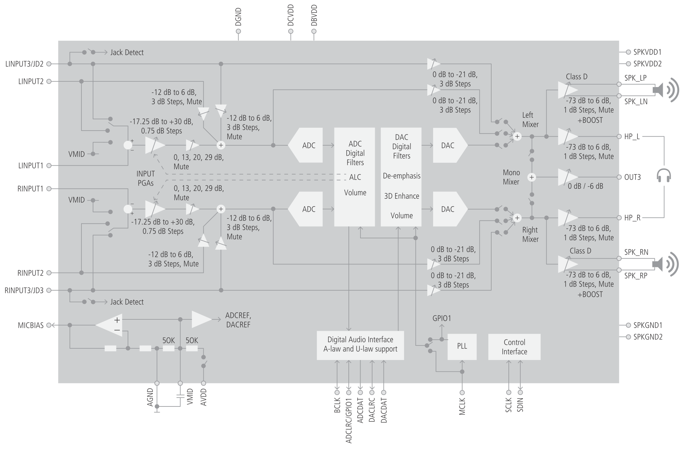

MT76x8 WM8960 ALSA SoC machine driver
=====================================
## Requirements
* Linux Kernel 4.9 or later.

## Known issues
1. Capture does not work.
2. Need to turn on `"Left Output Mixer PCM"` and `"Right Output Mixer PCM"` via `alsamixer` or `amixer` before playback.

## WM8960 block diagram

