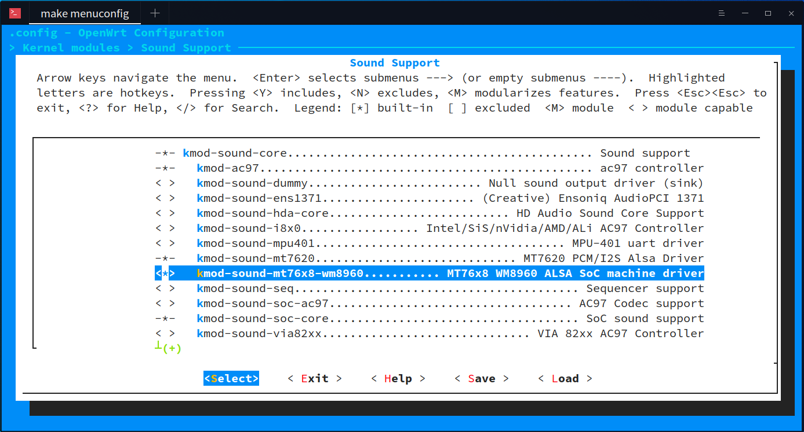
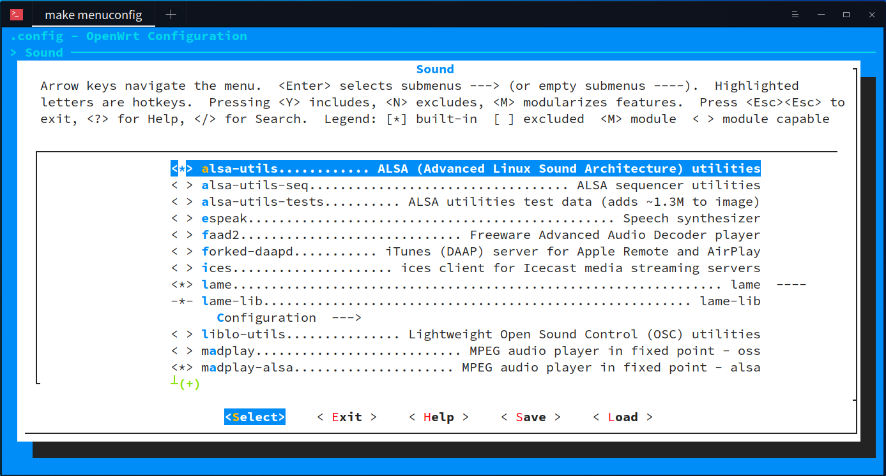

MT762X WM8960 ALSA SoC machine driver
=====================================

ALSA SoC machine driver for MT762X SoCs with WM8960 CODEC chip.

## Requirements

* OpenWrt with kernel 4.9 or later.

## Preparing

* Add the `mt762x-wm8960` folder to the `package/kernel` folder of OpenWrt.
```
cd package/kernel
git clone https://github.com/redchenjs/mt762x-wm8960.git
```
* Modify the target DTS file in the `target/linux/ramips/dts` folder of OpenWrt according to the example DTS files.

### WM8960 MCLK

The WM8960 can get `MCLK` from an externel clock source or the `refclk` output of MT762X SoCs (12MHz). To enable the `refclk` output, you can modify the dts file as follows:
```
refclk {
	ralink,group = "refclk";
	ralink,function = "refclk";
};
```

### WM8960 ADCLRC

The WM8960 can internally get `ADCLRC` from `DACLRC` and the `ADCLRC` pin can be used as `GPIO1`. It is useful for some boards that only have the `DACLRC` pin connected and the `ADCLRC` pin is left floating. To enable this feature, modify the dts file as follows:
```
codec: wm8960@1a {
	compatible = "wlf,wm8960";
	reg = <0x1a>;
	wlf,shared-lrclk;
	wlf,adclrc-as-gpio;
};
```

## Configuring the OpenWrt

`make menuconfig`

### Kernel modules:

* Navigate to `> Kernel modules > Sound Support`.
* Select `kmod-sound-core` and `kmod-sound-mt762x-wm8960`.



### Userspace tools:

* Navigate to `> Sound` and select `alsa-utils`.



## Building the image

`make -j9 V=s`

## Settings

The WM8960 will be muted after a reboot. Remember to properly set the volume before playing.

```
amixer sset "Headphone" 90
amixer sset "Speaker" 90
```

### Playback

```
amixer sset "Left Output Mixer PCM" on
amixer sset "Right Output Mixer PCM" on
```

### Capture

```
amixer sset "Left Input Mixer Boost" on
amixer sset "Right Input Mixer Boost" on
amixer sset "ALC Function" "Stereo"
```

## References

### WM8960 block diagram


